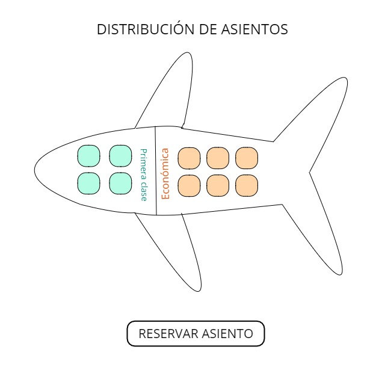
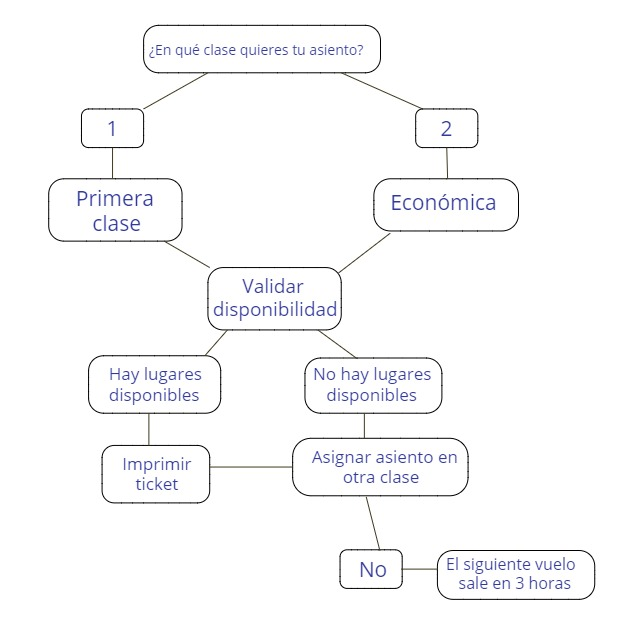

## Creando interacción con JavaScript

Realizar una aplicación para asignar asientos en cada vuelo del único avión de la aerolínea (capacidad: 10 asientos).

La aplicación debe mostrar las siguientes alternativas:

Por favor escriba 1 para Primera Clase y Por favor escriba 2 para Económico.

Si el usuario escribe 1, la aplicación debe asignarle un asiento en la sección de primera clase (asientos 1 a 4). Si el usuario escribe 2, la aplicación debe asignarle un asiento en la sección económica (asientos 5 a 10).

La aplicación deberá entonces imprimir un pase de abordar, indicando el número de asiento de la persona y si se encuentra en la sección de primera clase o clase económica.

Usando un arreglo unidimensional del tipo booleano para representar la tabla de asientos del avión. Se inicializo todos los elementos del arreglo con -false- para indicar que todos los asientos están vacíos. A medida que se asigne cada asiento, se establece el elemento correspondiente del arreglo en true para indicar que ese asiento ya no está disponible.

La aplicación nunca deberá asignar un asiento que ya haya sido asignado. Cuando esté llena la sección económica o primera clase, se deberá preguntar a la persona si acepta ser colocada en la sección de primera clase (y viceversa).

Si la persona acepta, haga la asignación de asiento apropiada.

Si no, debe imprimir el mensaje “El próximo vuelo sale en 3 horas”

